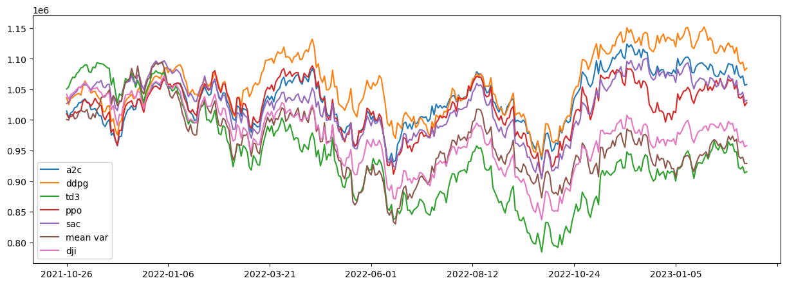

# Stock Trader
Machine Learning Project

## Replication of the original paper
Can be fount on the folder [Orginal Paper](./Replication%20of%20the%20original%20paper/)

Its both on the DJON and the DSE dataset

## Our Findings
Can be found on the folder [Our Findings](./Our%20Findings/)
The folder contains the following:
- [Oringinal Reward Funtion on DSE](./Our%20Findings/dse_on_original_reward.ipynb)
- [Cashless penalty reward function on DSE](./Our%20Findings/dse_on_cashless_penalty_reward.ipynb)
- [Stop Loss reward function on DSE](./Our%20Findings/dse_on_stoploss_reward.ipynb)

## Dataset
- [Kaggle DSE](https://www.kaggle.com/datasets/mahmudulhaque/dsebd)
- DSE
- [Amar Stock DSE](https://www.amarstock.com/csv-data-download)

## Results 
### Replication of the original paper on DJI 30

### Original Reward Function on DSE
<!-- include image images.png -->

### Cashless Penalty Reward Function on DSE

### Stop Loss Reward Function on DSE

## Turbulence and STD of DSE
<!--  -->

## FinRL
Organization: AI4Finance
GitHub: [Repositories](https://github.com/orgs/AI4Finance-Foundation/repositories)

